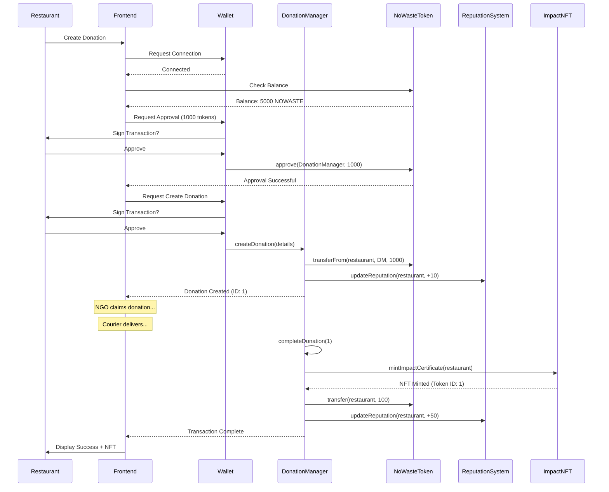

## Visit 

https://0-waste.netlify.app/

## Protocol Overview

### What is NoWaste Protocol?

NoWaste Protocol is a blockchain-based ecosystem that transforms food waste management through decentralization, transparency, and economic incentives. Built on VeryChain, the protocol connects restaurants, NGOs, and couriers in a trustless network where surplus food is efficiently redistributed to those in need while rewarding all participants.

### How It Works

The protocol operates through a **stake-to-earn** mechanism with three key participants:

1. **Restaurants** create donation listings by staking 1,000 NOWASTE tokens, describing surplus food (type, quantity, location, expiry)
2. **NGOs** browse available donations and claim them by staking 500 NOWASTE tokens, committing to accept delivery
3. **Couriers** accept delivery jobs by staking 750 NOWASTE tokens, handling logistics between restaurants and NGOs

When a deal completes successfully:
- All participants receive their stakes back + bonus rewards
- Restaurant earns 100 NOWASTE tokens + Impact NFT certificate
- NGO earns 50 NOWASTE tokens
- Courier earns 75+ NOWASTE tokens (varies by distance/reputation)
- Everyone's reputation score increases, unlocking higher rewards

If any party fails to fulfill their commitment, their stake is slashed and redistributed to honest participants.

### Protocol Integration Architecture

```
┌─────────────────────────────────────────────────────────────┐
│                        Frontend DApp                         │
│                    (React + Ethers.js)                       │
└────────────────────────┬────────────────────────────────────┘
                         │
                         ▼
┌─────────────────────────────────────────────────────────────┐
│                      VeryChain Network                      │
│                                         
└────────────────────────┬────────────────────────────────────┘
                         │
        ┌────────────────┼────────────────┐
        │                │                │
        ▼                ▼                ▼
┌──────────────┐  ┌──────────────┐  ┌──────────────┐
│ NoWasteToken │  │  Donation    │  │  Reputation  │
│   (ERC-20)   │  │   Manager    │  │    System    │
└──────┬───────┘  └──────┬───────┘  └──────┬───────┘
       │                 │                  │
       └────────┬────────┴────────┬─────────┘
                │                 │
        ┌───────▼────────┐  ┌────▼──────────┐
        │   ImpactNFT    │  │  Carbon       │
        │   (ERC-721)    │  │  Registry     │
        └────────────────┘  └───────────────┘
```


### Key Benefits

 **Trust Minimization**: Smart contracts enforce rules automatically - no central authority needed

 **Economic Incentives**: All participants earn tokens and reputation for honest behavior

 **Environmental Impact**: Each donation prevents CO₂ emissions, tracked permanently on-chain

 **Proof of Impact**: NFT certificates serve as verifiable proof of social/environmental contribution

 **Transparency**: All transactions, donations, and impacts are publicly auditable

 **Community Governance**: Token holders vote on protocol upgrades, fee structures, and partnerships

## Features Implemented

### Core Infrastructure
- **Web3 Integration**: Full MetaMask wallet connection with multi-chain support
- **Smart Contract Interaction**: Integrated with all 6 core contracts
- **React Context API**: Centralized Web3 state management
- **Toast Notifications**: User-friendly transaction feedback


## Smart Contract Integration

### Contracts Used

1. **NoWasteToken** (`NoWasteToken.sol`)
   - Token balance queries
   - Staking/unstaking
   - Approval for spending

2. **DonationManager** (`DonationManager.sol`)
   - Create donations
   - Claim donations
   - Confirm pickup/delivery
   - Fetch available/user deals

3. **ReputationSystem** (`ReputationSystem.sol`)
   - Get user reputation score
   - Calculate reward multipliers
   - Fetch tier information

4. **ImpactNFT** (`ImpactNFT.sol`)
   - Mint Impact NFTs
   - Fetch user's NFT collection
   - Get NFT metadata

5. **CarbonCreditRegistry** (`CarbonCreditRegistry.sol`)
   - Track carbon credits
   - Calculate CO₂ prevented

6. **DAOGovernance** (`DAOGovernance.sol`)
   - Create proposals
   - Vote on governance decisions

## User Flow Diagram


## Smart Contract Interaction Flow


