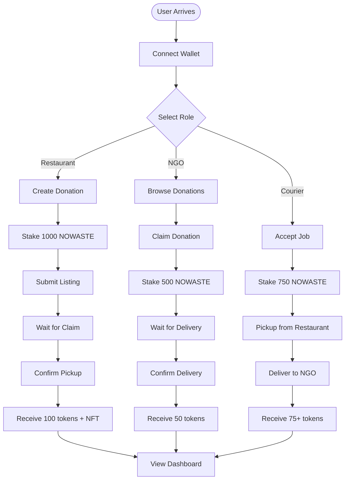
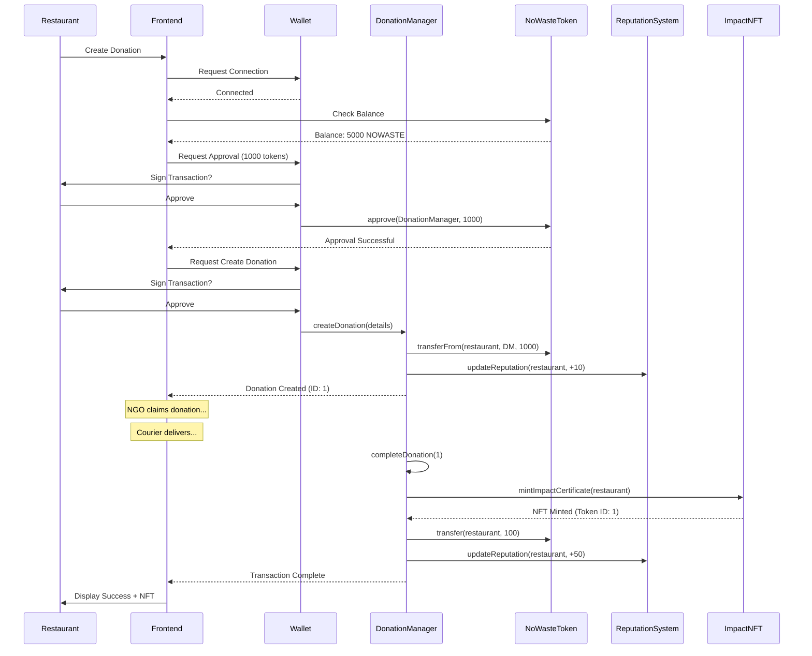

# NoWaste Protocol - Frontend DApp

A decentralized application for the NoWaste Protocol, enabling transparent food waste management in decentralized way.

## Features Implemented

### Core Infrastructure
- **Web3 Integration**: Full MetaMask wallet connection with multi-chain support
- **Smart Contract Interaction**: Integrated with all 6 core contracts
- **React Context API**: Centralized Web3 state management
- **Toast Notifications**: User-friendly transaction feedback

### User Interface Components

#### 1. **Navbar**
- MetaMask wallet connection/disconnection
- Network indicator (Polygon Mumbai/Mainnet)
- Responsive navigation menu
- Protected routes (requires wallet connection)

#### 2. **Home Page**
- Hero section with protocol overview
- Platform statistics display
- How It Works section (Restaurant/NGO/Courier flows)
- Tokenomics explanation
- Environmental impact showcase
- Call-to-action sections

#### 3. **Dashboard**
- Token balance (available & staked)
- Reputation score with tier system (Bronze/Silver/Gold/Platinum)
- Impact NFT count
- Total CO₂ prevented
- Deal statistics (success rate, consecutive wins)
- Quick action buttons

#### 4. **Available Deals**
- Browse all active donation listings
- Filter by food type, location, expiry
- Claim donations (NGO feature)
- Auto token approval flow
- Real-time status updates

#### 5. **My Deals**
- View user's donation history
- Track deal status (Listed → Claimed → Delivered → Verified)
- Confirm pickup/delivery actions
- Transaction history

#### 6. **Create Donation (Make a Deal)**
- Form for restaurant owners
- Token staking requirement display
- Food type selection (Veg/Non-veg)
- Quantity and weight inputs
- GPS location capture
- Smart contract submission

#### 7. **Impact NFT Gallery**
- Display all user's Impact NFTs
- Show CO₂ prevented per NFT
- Total environmental impact calculation
- NFT metadata viewer
- Download certificate feature (coming soon)

## 🔗 Smart Contract Integration

### Contracts Used

1. **NoWasteToken** (`NoWasteToken.sol`)
   - Token balance queries
   - Staking/unstaking
   - Approval for spending

2. **DonationManager** (`DonationManager.sol`)
   - Create donations
   - Claim donations
   - Confirm pickup/delivery
   - Fetch available/user deals

3. **ReputationSystem** (`ReputationSystem.sol`)
   - Get user reputation score
   - Calculate reward multipliers
   - Fetch tier information

4. **ImpactNFT** (`ImpactNFT.sol`)
   - Mint Impact NFTs
   - Fetch user's NFT collection
   - Get NFT metadata

5. **CarbonCreditRegistry** (`CarbonCreditRegistry.sol`)
   - Track carbon credits
   - Calculate CO₂ prevented

6. **DAOGovernance** (`DAOGovernance.sol`)
   - Create proposals
   - Vote on governance decisions

## 📱 User Flows

### Restaurant Owner Flow
1. Connect wallet
2. Go to "Create Donation"
3. Fill form (food type, quantity, location)
4. Stake 1000 NOWASTE tokens
5. Submit donation listing
6. Confirm pickup when courier arrives
7. Receive tokens + reputation + Impact NFT

### NGO Flow
1. Connect wallet
2. Browse "Available Deals"
3. Claim desired donation
4. Stake 500 NOWASTE tokens
5. Wait for courier pickup
6. Confirm delivery receipt
7. Receive tokens + reputation

### Courier Flow
1. Connect wallet
2. Accept delivery job
3. Stake 750 NOWASTE tokens
4. Pick up from restaurant
5. Deliver to NGO
6. Get both confirmations
7. Receive tokens + reputation

## User Flow Diagram

## Smart Contract Interaction Flow

